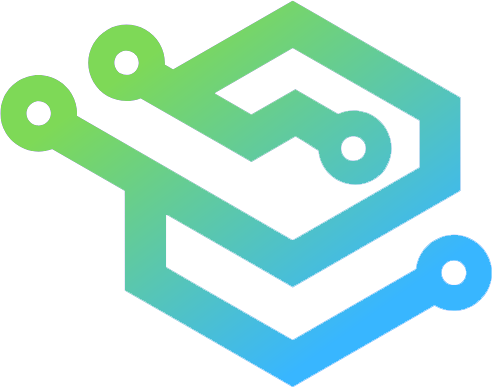

<a name="readme-top"></a>
<!-- PROJECT SHIELDS -->
<!--
*** I'm using markdown "reference style" links for readability.
*** Reference links are enclosed in brackets [ ] instead of parentheses ( ).
*** See the bottom of this document for the declaration of the reference variables
*** for contributors-url, forks-url, etc. This is an optional, concise syntax you may use.
*** https://www.markdownguide.org/basic-syntax/#reference-style-links
-->

[![Contributors][contributors-shield]][contributors-url]
[![Forks][forks-shield]][forks-url]
[![Stargazers][stars-shield]][stars-url]
[![Issues][issues-shield]][issues-url]
[![MIT License][license-shield]][license-url]

<!-- PROJECT LOGO -->
<br />
<div align="center">
  <a href="https://github.com/tokudayo/AIFA">
    
  </a>

<h3 align="center">AIFA</h3>
  <p align="center">
    AI-Based Solution for Exercise Posture Correction
    <!-- <br />
    <a href="https://github.com/tokudayo/AIFA"><strong>Explore the docs »</strong></a>
    <br /> -->
    <br />
    <a href="https://youtu.be/ob0Jm7McZMM">View Demo</a>
    ·
    <a href="https://github.com/tokudayo/AIFA/issues">Report Bug</a>
    ·
    <a href="https://github.com/tokudayo/AIFA/issues">Request Feature</a>
  </p>
</div>


<!-- ABOUT THE PROJECT -->
## About The Project
**AIFA** is a real-time, AI-powered system that assists user in correcting exercise postures.

<!-- 
`tokudayo`, `AIFA`, `twitter_handle`, `linkedin_username`, `email_client`, `email`, `AIFA`, `project_description` 
-->

### Built With
* [![Python][Python]][Python-url]
* [![Node.js][Node.js]][Node-url]
* [![Docker][Docker]][Docker-url]

<p align="right">(<a href="#readme-top">back to top</a>)</p>


<!-- AI -->
## AI
We provide a Python package for setting up the system locally.

### Prerequisites
* Python 3.10

### Installation
To get the AI running, follow these steps:
1. Clone the repo
   ```sh
   git clone https://github.com/tokudayo/AIFA.git
   ```
2. Setup Python environment
	 ```sh
	  pip install -r ai/requirements.txt
	```
### Usage
For evaluation, use either ```eval.py``` or ```webcam.py```. Here is an example of using ``eval.py`` to evaluate:
```sh
python -m scripts.eval
```
For more details, please refer to the [AI Documentation](docs/AI.md).


### Example
Here is an example of the system in action. The system will track the user's pose and provide feedback should there be any errors.
<p align="right">(<a href="#readme-top">back to top</a>)</p>

<!-- SOFTWARE -->
## Software

### Prerequisites
To deploy the software, you need to have the following installed:
* WSL 2 (required if you are using Windows)
* Docker 20.10.17

### Installation
To get the software running with Docker, follow these steps:
1. Clone the repo
   ```sh
   git clone https://github.com/tokudayo/AIFA.git
   ```
2. Rename ```.env.example``` to ```.env``` and fill in the required information.
3. Build the images and run the container.
    ```sh
    docker-compose up -d
    ```
  For more details, please refer to the [Software Documentation](docs/Software.md).

### Demo
We provided a demo video for the software. Please refer to the [Demo Video](https://youtu.be/ob0Jm7McZMM).

<p align="right">(<a href="#readme-top">back to top</a>)</p>

<!-- LICENSE -->
## License

Distributed under the **BSD 3-Clause License** License. See `LICENSE` for more information.

<p align="right">(<a href="#readme-top">back to top</a>)</p>

<!-- ACKNOWLEDGMENTS -->
## Acknowledgments

* []()
* []()
* []()

<p align="right">(<a href="#readme-top">back to top</a>)</p>


<!-- MARKDOWN LINKS & IMAGES -->
<!-- https://www.markdownguide.org/basic-syntax/#reference-style-links -->
[contributors-shield]: https://img.shields.io/github/contributors/tokudayo/AIFA.svg?style=for-the-badge
[contributors-url]: https://github.com/tokudayo/AIFA/graphs/contributors
[forks-shield]: https://img.shields.io/github/forks/tokudayo/AIFA.svg?style=for-the-badge
[forks-url]: https://github.com/tokudayo/AIFA/network/members
[stars-shield]: https://img.shields.io/github/stars/tokudayo/AIFA.svg?style=for-the-badge
[stars-url]: https://github.com/tokudayo/AIFA/stargazers
[issues-shield]: https://img.shields.io/github/issues/tokudayo/AIFA.svg?style=for-the-badge
[issues-url]: https://github.com/tokudayo/AIFA/issues
[license-shield]: https://img.shields.io/github/license/tokudayo/AIFA.svg?style=for-the-badge
[license-url]: https://github.com/tokudayo/AIFA/blob/master/LICENSE.txt
[Python]: https://img.shields.io/badge/Python-14354C?style=for-the-badge&logo=python&logoColor=white
[Python-url]: https://www.python.org/
[Node.js]: https://img.shields.io/badge/Node.js-43853D?style=for-the-badge&logo=node-dot-js&logoColor=white
[Node-url]: https://nodejs.org/en/
[Docker]: https://img.shields.io/badge/Docker-2CA5E0?style=for-the-badge&logo=docker&logoColor=white
[Docker-url]: https://www.docker.com/
